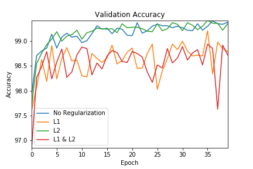

# EVA_S6

### Objective:
#### Train 4 models on MNIST dataset as follows and compare the performance of models:

Models are built in 40 epochs each with ~9K Parameters:
1. Without Regularisation
2. With L1 Regularisation, alpha = 0.0005
3. With L2 Regularisation, alpha = 0.0005
4. With L1 & L2 Regularisation, alpha = 0.0005

#### Train and Test Accuracy of four models built are:

1. Without any Regularisation                       :Train Accuracy = 99.25% , Test Accuracy = 99.38%
2. With L1 Regularisation with alpha = 0.0005       :Train Accuracy = 98.03% , Test Accuracy = 98.79%
3. With L2 Regularisation with alpha = 0.0005       :Train Accuracy = 99.14% , Test Accuracy = 99.35%
4. With L1 & L2 Regularisation with alpha = 0.0005  :Train Accuracy = 98.04% , Test Accuracy = 98.72%

#### Test Accuracy and Test Loss plots of 4 models:
 

